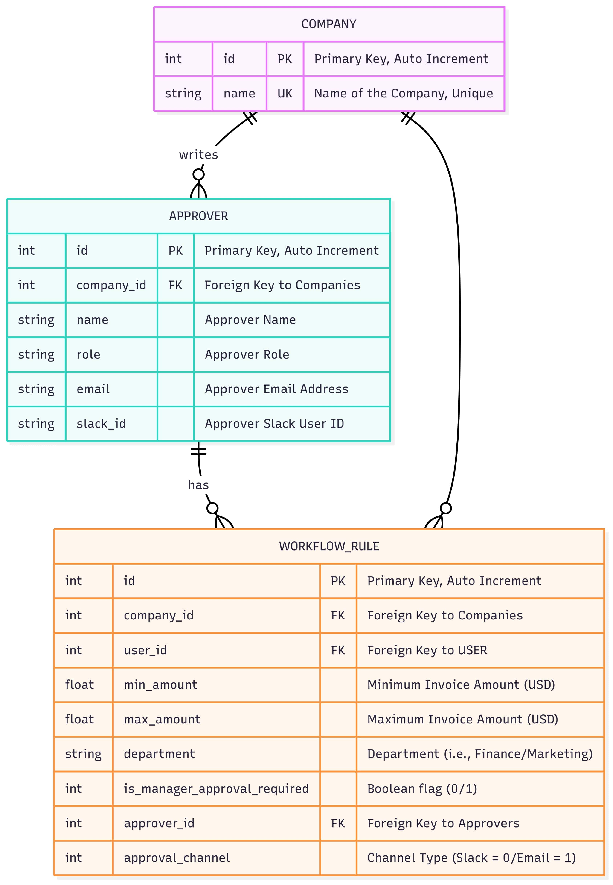

# Invoice Approval Workflow CLI

`backend-challenge-cli` is a command-line interface (CLI) tool for managing invoice approval workflows. This application implements a comprehensive invoice approval system where companies can define workflow rules that automatically route approval requests to the appropriate approvers based on invoice amount, department, and manager approval requirements.

## Overview

This solution was developed as part of the Light backend challenge, implementing an invoice approval workflow system in **Go**. The application allows companies to configure approval workflows through a set of rules that determine which approver should receive approval requests based on specific criteria.

### Key Features

- **Interactive Invoice Processing**: Process invoices through an interactive CLI workflow
- **Workflow Rule Management**: Create, update, delete, and list workflow rules
- **Approver Management**: Manage company approvers with full CRUD operations
- **Multi-Channel Notifications**: Support for both Slack and Email approval channels
- **In-Memory SQLite Database**: Fast, lightweight database with pre-seeded sample data
- **Comprehensive CLI Interface**: Full command-line interface with help and examples

## Installation

### Using Go Commands

To build and install the CLI tool, run the following commands:

```bash
# Build the application
go build -o backend-challenge-cli .

# Or install it globally
go install .
```

### Using Makefile

The project includes a comprehensive Makefile with various build and utility commands:

```bash
# Build the CLI application
make build

# Run CLI with default company 'Light'
make run-cli

# Run CLI with custom company
make run-cli-custom COMPANY="MyCompany"

# Show CLI help
make help-cli

# Run tests
make test

# Run tests with coverage
make test-coverage

# Clean build artifacts
make clean

# Install dependencies
make deps

# Show all available make commands
make help
```

## Usage

The CLI supports several commands for managing workflow rules, approvers, and processing invoices. Each command also supports various flags for customization.

### Global Flags

- `--company`, `-c`: Company name for the workflow service (default: "Light")
- `--departments`, `-d`: Comma-separated list of departments (default: "Marketing,Finance")
- `--slack-connection-string`: Connection string for Slack notifications
- `--email-connection-string`: Connection string for email notifications
- `--verbose`, `-v`: Enable verbose output

### Commands

## Process Invoice

Processes an invoice through the approval workflow interactively.

**Usage:**

```bash
backend-challenge-cli process-invoice
backend-challenge-cli invoice
backend-challenge-cli i
```

**Example:**

```bash
# Process invoice with default company
backend-challenge-cli process-invoice

# Process invoice with custom company
backend-challenge-cli --company "MyCompany" process-invoice

# Process invoice with verbose output
backend-challenge-cli --verbose process-invoice
```

This command will prompt you to enter:
- Invoice amount (USD)
- Department (Finance or Marketing)
- Whether manager approval is required

## Workflow Rules Management

### Create Workflow Rule

Creates a new workflow rule for the company.

**Usage:**

```bash
backend-challenge-cli create-workflow-rule --approver-id <id> --approval-channel <channel> [options]
backend-challenge-cli cwr --approver-id <id> --approval-channel <channel> [options]
```

**Options:**
- `--min-amount`, `-min`: Minimum amount for the rule (optional)
- `--max-amount`, `-max`: Maximum amount for the rule (optional)
- `--department`, `-d`: Department for the rule (optional)
- `--approver-id`, `-aid`: ID of the approver (required)
- `--approval-channel`, `-ac`: Approval channel (0=Slack, 1=Email) (required)
- `--manager-approval`, `-ma`: Whether manager approval is required (0=No, 1=Yes) (optional)

**Examples:**

```bash
# Create rule for invoices under $5k to Finance Team via Slack
backend-challenge-cli create-workflow-rule --max-amount 5000 --approver-id 1 --approval-channel 0

# Create rule for Marketing invoices $10k+ to CMO via Email
backend-challenge-cli cwr --min-amount 10000 --department "Marketing" --approver-id 4 --approval-channel 1

# Create rule with manager approval requirement
backend-challenge-cli create-workflow-rule --min-amount 5000 --max-amount 10000 --approver-id 2 --approval-channel 1 --manager-approval 1
```

##### Update Workflow Rule

Updates an existing workflow rule.

**Usage:**

```bash
backend-challenge-cli update-workflow-rule --id <id> --approver-id <id> --approval-channel <channel> [options]
backend-challenge-cli uwr --id <id> --approver-id <id> --approval-channel <channel> [options]
```

**Examples:**

```bash
# Update rule to change amount range and approver
backend-challenge-cli update-workflow-rule --id 1 --min-amount 200 --max-amount 600 --approver-id 2 --approval-channel 1

# Update rule to change department and approval channel
backend-challenge-cli uwr --id 2 --department "Finance" --approver-id 3 --approval-channel 0

# Update rule to add manager approval requirement
backend-challenge-cli update-workflow-rule --id 3 --min-amount 1000 --max-amount 5000 --approver-id 1 --approval-channel 1 --manager-approval 1
```

##### Delete Workflow Rule

Deletes a workflow rule by ID.

**Usage:**

```bash
backend-challenge-cli delete-workflow-rule --id <id>
backend-challenge-cli dwr --id <id>
```

**Example:**

```bash
backend-challenge-cli delete-workflow-rule --id 1
```

##### Get Workflow Rule

Retrieves a workflow rule by ID.

**Usage:**

```bash
backend-challenge-cli get-workflow-rule --id <id>
backend-challenge-cli gwr --id <id>
```

**Example:**

```bash
backend-challenge-cli get-workflow-rule --id 1
```

##### List Workflow Rules

Lists all workflow rules for the company.

**Usage:**

```bash
backend-challenge-cli list-workflow-rules
backend-challenge-cli lwr
```

**Example:**

```bash
backend-challenge-cli list-workflow-rules
```

#### Approver Management

##### Create Approver

Creates a new approver for the company.

**Usage:**

```bash
backend-challenge-cli create-approver --name <name> --role <role> --email <email> --slack-id <slack_id>
backend-challenge-cli ca --name <name> --role <role> --email <email> --slack-id <slack_id>
```

**Example:**

```bash
backend-challenge-cli create-approver --name "John Doe" --role "Manager" --email "john@example.com" --slack-id "U123456"
```

##### Update Approver

Updates an existing approver.

**Usage:**

```bash
backend-challenge-cli update-approver --id <id> --name <name> --role <role> --email <email> --slack-id <slack_id>
backend-challenge-cli ua --id <id> --name <name> --role <role> --email <email> --slack-id <slack_id>
```

**Example:**

```bash
backend-challenge-cli update-approver --id 1 --name "John Doe Updated" --role "Senior Manager" --email "john.updated@example.com" --slack-id "U123456"
```

##### Delete Approver

Deletes an approver by ID.

**Usage:**

```bash
backend-challenge-cli delete-approver --id <id>
backend-challenge-cli da --id <id>
```

**Example:**

```bash
backend-challenge-cli delete-approver --id 1
```

##### Get Approver

Retrieves an approver by ID.

**Usage:**

```bash
backend-challenge-cli get-approver --id <id>
backend-challenge-cli ga --id <id>
```

**Example:**

```bash
backend-challenge-cli get-approver --id 1
```

##### List Approvers

Lists all approvers for the company.

**Usage:**

```bash
backend-challenge-cli list-approvers
backend-challenge-cli la
```

**Example:**

```bash
backend-challenge-cli list-approvers
```

## Architecture

The Go codebase is structured with a clean architecture pattern, consisting of three main services:

### 1. Workflow Service (`workflow/`)
The core business logic service responsible for:
- Finding matching workflow rules based on invoice criteria
- Processing invoices through the approval workflow
- Managing the interactive CLI interface for invoice processing
- Coordinating between database and notification services

### 2. Management Service (`management/`)
Handles all data management operations:
- CRUD operations for workflow rules
- CRUD operations for approvers
- Data validation and business rule enforcement
- API-to-database model conversion

### 3. Database Service (`db/`)
Provides all database interactions:
- In-memory SQLite database implementation
- Database schema management
- Sample data seeding
- Store pattern for different entity types (companies, approvers, workflow rules)

## Database

The application uses an **in-memory SQLite database** that is automatically created and seeded with sample data when the application starts.

### Database Schema



*Figure 1: Database schema showing the relationships between companies, approvers, and workflow rules*

### Schema
- **companies**: Stores company information
- **approvers**: Stores employee information who can approve invoices
- **workflow_rules**: Defines the approval workflow rules

### Sample Data
The database is pre-populated with sample data from the challenge requirements, including:
- **Light** company
- **4 approvers**: Finance Team Member, Vera Sander (Finance Manager), Amanda Svensson (CFO), Sarah Johnson (CMO)
- **5 workflow rules** implementing the approval logic from the challenge diagram

### Workflow Rules (Pre-seeded)
1. **Rule 1**: Send to Finance Team Member via Slack when invoice < $5k
2. **Rule 2**: Send to Finance Team Member via Email when $5k ≤ invoice < $10k
3. **Rule 3**: Send to Finance Manager via Email when $5k ≤ invoice < $10k and manager approval required
4. **Rule 4**: Send to CFO via Slack when invoice ≥ $10k (not marketing)
5. **Rule 5**: Send to CMO via Email when invoice ≥ $10k and related to marketing

### Rule Matching Algorithm

The system uses a sophisticated SQL query to find the most specific matching rule for each invoice. The query implements a **priority-based matching system** that ensures the most specific rule is selected when multiple rules could apply.

#### SQL Query Implementation

```sql
SELECT id, company_id, min_amount, max_amount, department, 
       is_manager_approval_required, approver_id, approval_channel 
FROM workflow_rules 
WHERE company_id = $1 
    AND (
        -- Amount logic: inclusive lower bound, exclusive upper bound
        (min_amount IS NULL OR $2 >= min_amount) AND
        (max_amount IS NULL OR $2 < max_amount)
    )
    AND (department IS NULL OR department = $3)
    AND (is_manager_approval_required IS NULL OR is_manager_approval_required = $4)
ORDER BY 
    (CASE WHEN min_amount IS NOT NULL THEN 1 ELSE 0 END +
     CASE WHEN max_amount IS NOT NULL THEN 1 ELSE 0 END +
     CASE WHEN department IS NOT NULL THEN 1 ELSE 0 END +
     CASE WHEN is_manager_approval_required IS NOT NULL THEN 1 ELSE 0 END) DESC,
    id
LIMIT 1
```

#### Priority Handling

The `ORDER BY` clause implements a **specificity-based priority system**:

1. **Specificity Score**: Each rule gets a score based on how many criteria are specified:
   - `min_amount IS NOT NULL` = +1 point
   - `max_amount IS NOT NULL` = +1 point  
   - `department IS NOT NULL` = +1 point
   - `is_manager_approval_required IS NOT NULL` = +1 point

2. **Rule Selection**: The rule with the **highest specificity score** is selected first
3. **Tie-breaking**: If multiple rules have the same score, the rule with the **lowest ID** (created first) is selected

#### Examples of Priority in Action

**Scenario 1: Overlapping Amount Ranges**
```yaml
# Rule A: General rule for all invoices under $10k
min_amount: null
max_amount: 10000
department: null
manager_approval: null
# Score: 1 (only max_amount specified)

# Rule B: Specific rule for Finance invoices $5k-$10k  
min_amount: 5000
max_amount: 10000
department: "Finance"
manager_approval: null
# Score: 3 (min_amount + max_amount + department)
```

For a Finance invoice of $7,500:
- Both rules match
- **Rule B wins** (score 3 > score 1) - more specific

**Scenario 2: Manager Approval Priority**
```yaml
# Rule A: General rule for Marketing invoices
min_amount: 10000
max_amount: null
department: "Marketing"
manager_approval: null
# Score: 2 (min_amount + department)

# Rule B: Specific rule for Marketing invoices requiring manager approval
min_amount: 10000
max_amount: null
department: "Marketing" 
manager_approval: 1
# Score: 3 (min_amount + department + manager_approval)
```

For a Marketing invoice of $15,000 requiring manager approval:
- Both rules match
- **Rule B wins** (score 3 > score 2) - more specific

**Scenario 3: Exact Amount Match**
```yaml
# Rule A: General rule for invoices under $5k
min_amount: null
max_amount: 5000
department: null
manager_approval: null
# Score: 1 (only max_amount)

# Rule B: Specific rule for exactly $3k invoices
min_amount: 3000
max_amount: 3000
department: null
manager_approval: null
# Score: 2 (min_amount + max_amount)
```

For an invoice of exactly $3,000:
- Both rules match
- **Rule B wins** (score 2 > score 1) - more specific

#### Alternative Approaches

**1. No Ordering (Assume No Overlapping Rules)**
```sql
-- Simple approach without ORDER BY
SELECT * FROM workflow_rules 
WHERE company_id = $1 AND [criteria...]
LIMIT 1
```
- **Pros**: Simpler query, faster execution
- **Cons**: Requires careful rule design to avoid conflicts
- **Use Case**: When business rules are designed to be mutually exclusive

**2. Explicit Priority Field**
```sql
-- Add priority column to workflow_rules table
ALTER TABLE workflow_rules ADD COLUMN priority INTEGER DEFAULT 0;

-- Query with explicit priority
SELECT * FROM workflow_rules 
WHERE company_id = $1 AND [criteria...]
ORDER BY priority DESC, id
LIMIT 1
```
- **Pros**: Explicit control over rule precedence
- **Cons**: Requires manual priority management
- **Use Case**: When business needs explicit control over rule ordering

The current implementation uses the **specificity-based approach** because it provides the most intuitive behavior: more specific rules naturally take precedence over general ones, which aligns with typical business logic expectations.

## Error Handling

The CLI provides comprehensive error handling with:
- Clear error messages for invalid inputs
- Network and database error handling
- Validation errors for business rules
- User-friendly error formatting with colored output

## Testing

The project includes comprehensive unit tests for all major components. Run the test suite using:

```bash
# Run all tests
make test

# Run tests with coverage
make test-coverage

# Run tests with verbose output
make test-verbose

# Generate detailed coverage report
go test -coverprofile=coverage.out ./... && go tool cover -func=coverage.out
```

### Current Test Coverage

The current test coverage across the codebase is **47.7%** of statements. Here's the breakdown by package:

| Package | Coverage | Status |
|---------|----------|---------|
| **common** | 100.0% | ✅ Excellent |
| **notification/email** | 100.0% | ✅ Excellent |
| **notification/slack** | 100.0% | ✅ Excellent |
| **db** | 90.9% | ✅ Very Good |
| **management** | 51.2% | ⚠️ Moderate |
| **workflow** | 45.8% | ⚠️ Moderate |
| **api** | 0.0% | ❌ No Tests |
| **cmd/cli** | 0.0% | ❌ No Tests |
| **config** | 0.0% | ❌ No Tests |
| **db/sqlite** | 0.0% | ❌ No Tests |

### Running Specific Tests

```bash
# Test specific package
go test ./workflow/

# Test with race detection
go test -race ./...

# Test with coverage for specific package
go test -cover ./management/

# Run tests with detailed output
go test -v ./db/
```

### Test Files

Key test files in the project:
- `common/logger_test.go` - Logger functionality tests
- `db/*_test.go` - Database store and service tests
- `management/service_test.go` - Management service tests
- `notification/*/service_test.go` - Notification service tests
- `workflow/service_test.go` - Workflow service tests

## Development

### Project Structure
```
backend-challenge-go/
├── api/                    # API models and interfaces
├── cmd/cli/               # CLI application entry point
├── common/                # Shared utilities (logging)
├── config/                # Configuration management
├── configs/               # Configuration files and sample data
├── db/                    # Database layer and stores
├── management/            # Management service
├── notification/          # Notification services (Slack, Email)
├── workflow/              # Core workflow service
└── main.go               # Application entry point
```

### Key Dependencies
- **urfave/cli/v2**: CLI framework
- **sqlite3**: Database driver
- **log/slog**: Structured logging